# Distributed Optimization: A MATLAB Tutorial with Examples

## Contents

1. [Overview](#overview)

2. [Simple Example of Multi-Agent Optimization](#simple-example-of-multi-agent-optimization)

3. [Real-world Application: Distributed Resource Allocation for Electric Vehicle (EV) Charging](#real-world-application-distributed-resource-allocation-for-electric-vehicle-ev-charging)
   
    3.1. [Solve with **Distributed Gradient Descent (DGD)**](#solve-with-dgd)
   
    3.2. [Solve with **Alternating Direction Method of Multipliers (ADMM)**](#solve-with-admm)
   
    3.3. [Solve with **Particle-Swarm Optimization (PSO)**](#solve-with-pso)
   
    3.4. [Solve with **Genetic Algorithm (GA)**](#solve-with-ga)
   
    3.5. [Discussion](#discussion)

4. [Real-world Application: Truck Platooning with Distributed Model Predictive Control (DMPC)](#real-world-application-truck-platooning-with-distributed-model-predictive-control-dmpc)

5. [References](#references)

## Overview

**Distributed optimization (DO)** in a multi-agent setting refers to a class of algorithms and frameworks in which a collection of agents—each with access to only a portion of the global objective or local constraints—collaboratively solve a joint optimization problem by exchanging information over a communication network. Rather than relying on a central coordinator, agents iteratively update their local decision variables (e.g., via gradient descent, dual decomposition, or alternating direction methods of multipliers) while performing consensus steps to enforce agreement on shared variables or coupling constraints. This approach scales gracefully with problem size, preserves privacy of local data, and can tolerate asynchronous updates or time-varying network topologies. Applications span from sensor fusion and resource allocation in wireless networks to coordinated control of autonomous vehicle fleets, where robustness to communication delays and agent failures is critical.

In this demo, we will demonstrate three MATLAB® examples, ranging from a simple toy problems to more challenging, real-world, applications:

1. A simple example showcasing the **average consensus**  problem solved with DO
2. Real-world Application: **Distributed Resource Allocation for Electric Vehicle (EV) Charging Stations**
3. Real-world Application: **Truck Platooning with Distributed Model Predictive Control (DMPC)**

How to run the demo:

1. Clone the Github MATLAB® project `DistributedOptimization.prj` to your local PC.

2. Start the project and run the four examples provided:
   
   2.1. `distributedOptim_simple_example.m` This is a simple demo that explains average consesus used in DO
   
   2.2. `distributedOptim_EV_charging_station.m` An elaborate example that showcases different DO methods. Four different DO methods are discussed: Distributed Gradient Descent (DGD), Alternating Direction Method of Multipliers (ADMM), Particle Swarm Optimization (PSO), and Genetic Algorithm (GA).
   
   2.3. `distributedOptim_truck_platooning.m` This example uses a DO based on Model-Predictive Control to solve a dynamic problem. 
   
   2.4. `centralizedOptim_truck_platooning.m` This example does not use DO, is using a centralized optimization instead. Is provided for reference only, to see how a centralized optimization can be used to handle multiple agents. The code is not documented in this README file, refer directly to the code comments for insights.

> 注：いくつかの例には日本語版もある（コメントは日本語）。また、README.mdにも日本語版があります。

MathWorks® products needed to run the examples:

1. MATLAB®
2. Optimization Toolbox™
3. Global Optimization Toolbox™

License: The license is available in the LICENSE.txt file in this GitHub repository.

### DO General Concept

```sql
1. Global Optimization Problem
   F(x₁, x₂, …, x_N)
   └─► Seek to Minimize/Maximize F by coordinating N agents

2. Multi-Agent System
   ├─ Agent 1
   ├─ Agent 2
   ├─ …
   └─ Agent N

3. Agent 1 Workflow (representative)
   ├─ [Local Data/Knowledge]
   │     • e.g. p_pref₁, local constraints
   ├─ [Local Objective/Cost]
   │     • e.g. (p₁ – p_pref₁)² or local part of F
   ├─ [Local Computation Engine]
   │     • Inputs: x₁(k), Local Objective
   │     └─► Method Choice:
   │          a) Gradient-Based
   │             1. Compute ∇f₁(x₁(k))
   │             2. Update using ∇f₁ and messages
   │          b) Gradient-Free
   │             1. Evaluate f₁(x₁(k))
   │             2. Heuristic update + messages
   ├─ [Prepare & Send Message]
   │     • Data depends on method (state, gradients, bids…)
   ├─ [Communication Network]
   │     • Topology: ring / star / mesh / complete
   │     • Carries messages between neighbors
   ├─ [Receive Messages]
   │     • From neighboring agents
   ├─ [Update State]
   │     • New estimate x₁(k+1)
   └─ [Iterate k→k+1]

4. Agent 2 Workflow
   (same steps as Agent 1, with its own data/objective)

5. …

6. Agent N Workflow
   (same pattern)

7. What’s Exchanged on the Network
   – Current states/estimates x_j(k)  
   – Local gradients ∇f_j  
   – Dual variables / prices λ_j  
   – Proposed actions or bids  
   – Best-known solutions (for meta-heuristics)  
   – Aggregated values (sums, averages)
```

**Explanation of the Diagram and Multi-Agent Optimization Process:**

1. **Global Optimization Problem ($F(x_1, \dots, x_N)$):**
   
   * This is the goal the entire system of agents aims to achieve.
   * It's often a function of all agents' variables/actions (e.g., minimize total cost, $\sum f_i(x_i)$, or achieve a consensus $x_1 = x_2 = \dots = x_N$).
   * The solution often requires coordination because an agent's optimal action might depend on others' actions or shared constraints.

2. **Multi-Agent System:**
   
   * Comprises multiple autonomous `Agent`s (Agent 1, Agent 2, ..., Agent $N$).
   * Each agent $i$ has its own decision variable $x_i$.

3. **Individual Agent (e.g., Agent 1):**
   
   * **Local Data/Knowledge:** Each agent possesses private information (e.g., for a BEV/PHEV, the preferred charging rate $p_{\text{pref},i}$, local sensor readings, local constraints).
   * **Local Objective/Cost:** Based on its local data and the global objective, each agent often has a local objective function $f_i(x_i)$ to optimize, or it contributes a part to the global objective. Sometimes, the local objective also includes terms related to its neighbors' states to enforce coupling or agreement.
   * **Agent State/Estimate ($x_i(k)$):** At each iteration $k$, the agent maintains its current value for its decision variable or its estimate of a global quantity.
   * **Local Computation Engine:** This is the core of the agent's decision-making.
     * It takes its current state $x_i(k)$, its local objective $f_i$, local data, and messages received from other agents.
     * It then applies a `Local Method` to compute its next action or update its state.
   * **Local Method:**
     * **Gradient-Based:**
       * If the local objective $f_i$ is differentiable, the agent can calculate its local gradient $\nabla f_i(x_i(k))$.
       * The update rule then typically involves a step along this negative gradient (for minimization) combined with information from neighbors (e.g., weighted average of neighbors' states in DGD, or updates based on dual variables in ADMM).
       * Examples: Distributed Gradient Descent (DGD), ADMM subproblems, dual decomposition methods.
     * **Gradient-Free:**
       * Used when gradients are unavailable, too costly to compute, or the problem is non-differentiable or black-box.
       * The agent evaluates its local objective $f_i(x_i(k))$ at its current state (or proposed states).
       * The update rule follows heuristic principles derived from the specific algorithm (e.g., a PSO particle updates its velocity and position based on its personal best and a neighborhood/global best; a GA individual undergoes selection, crossover, mutation).
       * Examples: Particle Swarm Optimization (PSO), Genetic Algorithms (GA), Ant Colony Optimization (ACO), Simulated Annealing (if adapted for distributed setting).
   * **Prepare/Send Message:** After local computation, the agent prepares a message containing relevant information to be sent to its neighbors.
   * **Receive Messages:** Before the next computation cycle, the agent receives messages from its neighbors.
   * **New State/Estimate ($x_i(k+1)$):** Based on its local computation and received messages, the agent updates its state.
   * **Iterate ($k \to k+1$):** The process repeats for a set number of iterations or until a convergence criterion is met. The messages received in one iteration are typically used for the computation in the *next* iteration.

4. **Communication Network:**
   
   * Defines which agents can exchange messages with each other.
   * **Topology:** Can be a complete graph (all-to-all), ring, star, mesh, or any other graph structure. The topology significantly impacts convergence speed and robustness.
   * Communication is usually assumed to be imperfect (delays, noise, link failures in more advanced models). For simplicity here, we assume reliable neighbor-to-neighbor communication.

5. **Information Exchanged (What is Communicated):**
   
   * The content of messages depends heavily on the specific distributed algorithm:
     * **Current states/estimates ($x_j(k)$):** Common in consensus algorithms (like DGD, where agents average their neighbors' states).
     * **Local gradients ($\nabla f_j$):** Some algorithms might exchange gradient information.
     * **Dual variables / Prices ($\lambda_j$):** Central to ADMM and dual decomposition methods, representing the "price" of violating shared constraints.
     * **Proposed actions / Bids:** In market-based mechanisms or some game-theoretic approaches.
     * **Best-known solutions:** In some distributed metaheuristics (e.g., a particle in PSO might share its personal best position, or receive information about the neighborhood's best).
     * **Aggregated values:** Agents might collaboratively compute sums or averages of certain local values (e.g., $\sum p_i$ in the ADMM EV charging example was estimated via consensus).

**Overall Flow:**

The system typically operates in iterative rounds:

1. **Initialization:** Agents start with an initial state $x_i(0)$.
2. **Iteration $k$:**
   a.  **Local Computation:** Each agent $i$, using its current state $x_i(k)$ and messages received in the previous round (or from iteration $k-1$), performs its local computation according to its chosen method (gradient-based or gradient-free).
   b.  **State Update:** The agent updates its state to $x_i(k+1)$.
   c.  **Communication:** Each agent $i$ sends messages (containing parts of $x_i(k+1)$ or other derived information) to its neighbors over the communication network.
3. **Repeat:** Increment $k$ and go to step 2a until convergence or max iterations.

The goal is for the agents' states $x_i$ to collectively converge to a solution (or a good approximation) of the global optimization problem $F$.

### Foundations of Distributed Optimization

- **Consensus‐based Gradient Methods** 
  
  - **Distributed Gradient Descent (DGD)**  and its accelerated versions (e.g. EXTRA, DIGing, NIDS) combine local gradient steps with consensus (averaging) to solve (strongly) convex problems over a network.
  
  - **Gradient Tracking**  methods track the global gradient estimate in each agent, yielding faster convergence and robustness to time‐varying graphs.

- **Operator Splitting & ADMM** 
  
  - **Decentralized ADMM**  applies the Alternating Direction Method of Multipliers in a peer-to-peer fashion, splitting the global objective into local subproblems plus consensus constraints.
  
  - Recent variants focus on **asynchronous** , **event‐triggered** , or **communication‐compressed**  updates to reduce messaging overhead.

- **Primal–Dual & Second-Order Methods** 
  
  - **Primal–Dual Algorithms**  (e.g. Chambolle–Pock style) have been adapted to networks, providing accelerated rates for saddle‐point problems.
  
  - **Distributed Newton / Quasi-Newton**  methods approximate curvature information locally to speed up convergence on ill-conditioned problems, often trading extra computation for fewer communication rounds.

---

### Swarm Intelligence Meta-heuristics

- **Particle Swarm Optimization (PSO) and Variants** 
  
  - **Quantum-behaved PSO (QPSO)** , **Bare-Bones PSO** , and **Fully Informed PSO**  improve exploration–exploitation trade-offs.
  
  - **Multi‐swarms**  decompose large searches into interacting sub-swarms, each optimizing part of the problem or exploring different regions.

- **Ant Colony Optimization (ACO)** 
  
  - **Max–Min ACO**  places explicit bounds on pheromone to avoid premature convergence.
  
  - **Hybrid ACO-PSO**  or **ACO-GA**  leverage complementary mechanisms (crossover/mutation or velocity updates) to escape local optima.

- **Other Bio-inspired Techniques** 
  
  - **Artificial Bee Colony (ABC)** , **Bacterial Foraging Optimization (BFO)** , and **Firefly Algorithm**  have been tuned with dynamic parameter adaptation, parallel populations, and Lévy‐flight steps to boost performance on high-dimensional, multi-modal objectives.

---

### Swarm / Multi-Agent Control

- **Consensus & Formation Control** 
  
  - **Leaderless Consensus**  protocols ensure all agents agree on a state (e.g. formation centroid, rendezvous point) despite only local neighbor communication.
  
  - **Leader–Follower**  architectures combine a subset of informed “leader” agents steering overall motion, with followers executing consensus to maintain geometry.

- **Distributed Model Predictive Control (DMPC)** 
  
  - Agents solve local MPC problems with coupling constraints (e.g. collision avoidance, resource sharing) via ADMM or dual decomposition, achieving near-centralized performance with limited communication.

- **Event-Triggered & Self-Triggered Control** 
  
  - To mitigate network load, agents only exchange information when certain state- or error-based thresholds are exceeded, guaranteeing stability and performance with drastically fewer messages.

- **Learning-Enhanced Control** 
  
  - **Graph Neural Networks (GNNs)**  and **Multi-Agent Reinforcement Learning (MARL)**  learn to coordinate control policies directly from data, handling nonlinear dynamics and partial observability.

---

### Key Trends & Open Challenges

- **Communication Efficiency** : compressed messages, quantized updates, and sporadic/event-triggered schemes to reduce bandwidth.

- **Robustness & Privacy** : algorithms that tolerate link failures, adversarial agents, and guarantee differential privacy.

- **Scalability** : handling thousands of agents via hierarchical swarms, subspace decompositions, or mean-field approximations.

- **Nonconvex & Time-Varying Objectives** : ensuring convergence in nonconvex landscapes (common in robotics or deep learning) and dynamically changing network topologies.

- **Bridging Meta-heuristics & Convex Methods** : hybrid frameworks that embed fast consensus‐based convex solvers within a global meta-heuristic outer loop for better global search.

---

### In Summary

State-of-the-art distributed optimization in multi-agent and swarm contexts synergizes **rigorous convex/ADMM‐style algorithms**  (with provable guarantees) with **bio-inspired meta-heuristics**  (for hard, nonconvex landscapes), while modern swarm control pushes for **learning-driven** , **communication-sparse** , and **robust**  coordination laws. This fusion enables large‐scale robotic teams, sensor networks, and distributed machine learning systems to operate efficiently under realistic network and agent constraints.

## Simple Example of Multi-Agent Optimization

Below is a prototype MATLAB script that illustrates a classic **average consensus**  toy problem in distributed optimization. Agents cooperatively minimize the quadratic cost

$$
f(x)\;=\;\sum_{i=1}^N \tfrac12\bigl(x - a_i\bigr)^2 
$$

by alternating **local gradient steps**  with **consensus averaging**  over a connected communication graph.

---

### Problem Formulation

One of the canonical toy problems in distributed optimization is the **average consensus**  problem, where $N$ agents seek to agree on the average of their initial values using only local communication ([Diva Portal](https://www.diva-portal.org/smash/get/diva2%3A453798/FULLTEXT01.pdf)) . Alternatively, this can be viewed as minimizing the quadratic cost

$$
f(x)\;=\;\sum_{i=1}^N \frac12\,(x - a_i)^2, 
$$

whose unique minimizer is the mean of $\{a_i\}$ ([ResearchGate](https://www.researchgate.net/publication/224371202_Distributed_Subgradient_Methods_for_Multi-Agent_Optimization)) .
Distributed (sub)gradient methods combine a gradient step with local averaging, yielding the **Distributed Gradient Descent (DGD)**  iteration:

$$
x_i^{(k+1)} \;=\;\sum_{j=1}^N W_{ij}\,x_j^{(k)} \;-\;\alpha\;\bigl(x_i^{(k)} - a_i\bigr), 
$$

where $W$ is a consensus weight matrix and $\alpha>0$ a step size ([SCIRP](https://www.scirp.org/%28S%28czeh2tfqw2orz553k1w0r45%29%29/reference/referencespapers?referenceid=3220708) ). Convergence under diminishing or small constant step sizes is well understood ([Massachusetts Institute of Technology](https://web.mit.edu/Asuman/Desktop/asuman/www/documents/distributed-journal-final.pdf)) .
Beyond gradient schemes, **Consensus ADMM**  offers an operator‐splitting approach for such problems, decoupling local minimization from consensus constraints via augmented Lagrangians ([Stanford University](https://web.stanford.edu/~boyd/papers/pdf/admm_distr_stats.pdf)) . Advanced frameworks like **Consensus ALADIN**  extend these ideas to nonconvex and multi‐layer settings using second‐order information ([arXiv](https://arxiv.org/pdf/2306.05662) ). Other variants include **Consensus Equilibrium**  methods on toy inverse problems ([Purdue Engineering](https://engineering.purdue.edu/~bouman/Plug-and-Play/webdocs/SIIMS01.pdf) ), **event‐triggered**  updates to reduce communication ([ScienceDirect](https://www.sciencedirect.com/science/article/abs/pii/S0893608023006925) ), and **multi‐layer consensus**  for multi‐objective optimization in smart grids ([ScienceDirect](https://www.sciencedirect.com/science/article/abs/pii/S0306261921007923)) .

---

### MATLAB Prototype Script

```matlab
% Distributed Average Consensus via DGD
%-------------------------------------------------------
% Number of agents
N = 10;

% Local data: each agent i holds value a(i)
a = randn(N,1) * 5 + 10;    % e.g. randomly around 10

% Communication graph: here, a ring or complete graph
% For simplicity, use complete graph weights (equal averaging)
W = ones(N) / N;

% Stepsize (small constant for stability)
alpha = 0.1;

% Initialization: each agent starts from zero
x = zeros(N,1);

% Number of iterations
T = 100;

% Store history for plotting
Xhist = zeros(N, T+1);
Xhist(:,1) = x;

for k = 1:T
    % Local consensus + gradient step
    x = W * x - alpha * (x - a);

    % Save
    Xhist(:,k+1) = x;
end

% True consensus value
x_star = mean(a);

[...] ⇦　code omitted for brevity
```

---

### How It Works

2. **Initialization** 

Each agent $i$ initializes its estimate $x_i^{(0)}=0$ and knows only its private data $a_i$.

4. **Consensus Step** 

At each iteration $k$, agents replace their state by a weighted average of neighbors via the matrix $W$. In a **complete graph** , $W_{ij}=1/N$.

6. **Local Gradient Step** 

Each agent adjusts toward its own minimizer $a_i$ by $-\alpha(x_i - a_i)$.

8. **Convergence** 

Under mild conditions on $\alpha$ and the connectivity of $W$, all $x_i^{(k)}$ converge to the global minimizer

$$
\overline{a} = \tfrac1N\sum_i a_i
$$

Below, the results obtained running the `distributedOptim_simple_example.m` script:

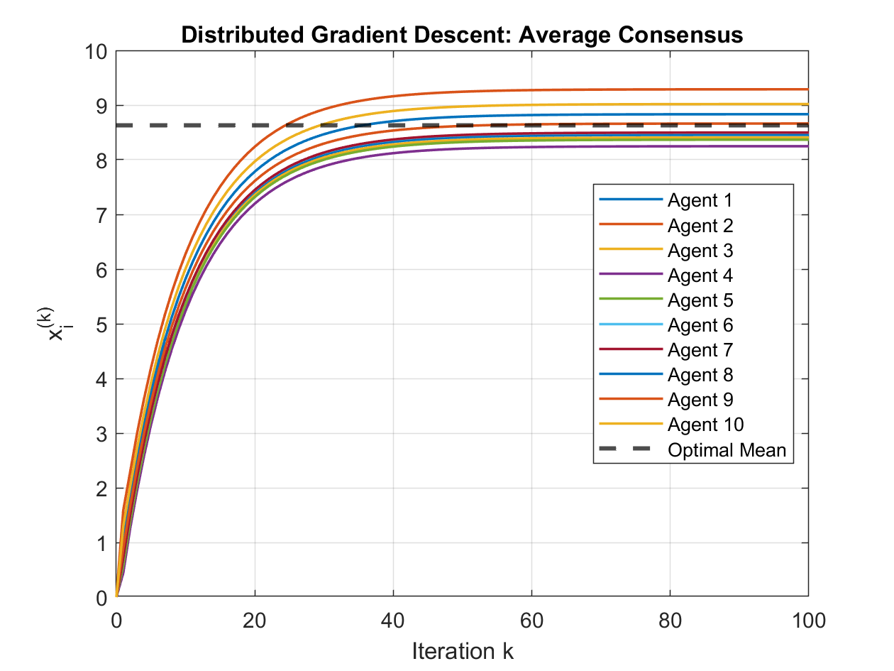

---

## Real-world Application: Distributed Resource Allocation for Electric Vehicle (EV) Charging

**Scenario:**
Imagine a set of $N$ electric vehicles that want to charge from a station with a total power capacity $P_{\text{total}}$. Each EV $i$ has a preferred charging rate $p_{\text{pref},i}$ (e.g., based on its battery size, current state of charge, and desired charging time). However, the sum of preferred rates might exceed $P_{\text{total}}$.

**Optimization Goal:**
We want to find actual charging rates $p_i$ for each EV such that:

1. The total power used does not exceed $P_{\text{total}}$: $\sum_i p_i = P_{\text{total}}$. (We'll aim to use all available power).
2. The allocation is "fair." A common way to achieve this is to minimize the sum of squared differences from their preferred rates, subject to the total power constraint:
   Minimize $\sum_i (p_i - p_{\text{pref},i})^2$
   Subject to $\sum_i p_i = P_{\text{total}}$

**Distributed Solution Approach:**
The analytical solution to this constrained optimization problem is:
$p_{i, \text{optimal}} = p_{\text{pref},i} + \frac{P_{\text{total}} - \sum_j p_{\text{pref},j}}{N}$

Notice the term $\frac{P_{\text{total}} - \sum_j p_{\text{pref},j}}{N}$. This can be rewritten as $\frac{P_{\text{total}}}{N} - \operatorname{mean}(p_{\text{pref}})$.
So, $p_{i, \text{optimal}} = p_{\text{pref},i} + \frac{P_{\text{total}}}{N} - \operatorname{mean}(p_{\text{pref}})$.

To implement this distributively:

1. Each EV knows its own $p_{\text{pref},i}$ and the global values $P_{\text{total}}$ and $N$.
2. The EVs need to cooperatively compute $\operatorname{mean}(p_{\text{pref}})$. This is exactly what the Distributed Average Consensus (using DGD) algorithm does!
3. Once each EV $i$ has a good estimate of $\operatorname{mean}(p_{\text{pref}})$ (let's call its estimate $z_i$), it can calculate its optimal power allocation: $p_i = p_{\text{pref},i} + \frac{P_{\text{total}}}{N} - z_i$.

### Solve with DGD

We'll adapt the simple DGD code to have agents converge on `mean(p_pref)`.

```matlab
% Distributed Resource Allocation for EV Charging via DGD
%-----------------------------------------------------------------

% Number of EVs (agents)
N = 10;

% Total Power Capacity of the charging station (e.g., kW)
P_total = 50; 

% Local data: Each EV i has a preferred charging rate p_pref(i)
% Let's say preferred rates are between 3 kW and 11 kW (typical Level 2 charging)
p_pref = rand(N,1) * 8 + 3; % Randomly between 3 and 11 kW

[...]

% For simplicity, use complete graph avg.
fprintf('Using simplified complete graph weights for W (equal averaging).\n');
W = ones(N) / N; 

%% Communication graph: Ring topology for a slightly more realistic scenario
%% than complete graph, but still simple.
%% For a ring, each agent communicates with two neighbors.
%W = zeros(N,N);
%for i = 1:N
%    W(i,i) = 1/3; % Weight for self
%    W(i, mod(i-1-1, N)+1) = 1/3; % Weight for previous neighbor (with wrap-around)
%    W(i, mod(i, N)+1) = 1/3;     % Weight for next neighbor (with wrap-around)
%end

% Stepsize for DGD (small constant for stability)
alpha = 0.2; 

% Initialization: Each agent's estimate of mean(p_pref) starts from zero
% (or could start from its own p_pref_i)
z = zeros(N,1); % z_i will be agent i's estimate of mean(p_pref)

% Number of iterations for consensus
T = 200;

% Store history for plotting convergence of z
Zhist = zeros(N, T+1);
Zhist(:,1) = z;

% --- DGD for estimating mean(p_pref) ---
for k = 1:T
    % Each agent updates its estimate z_i based on neighbors' estimates
    % and its own preferred rate p_pref_i.
    % The DGD update: z_new = W * z_old - alpha * (z_old - p_pref)
    % Here, 'a' from the simple example is 'p_pref'.
    % 'x' from the simple example is 'z'.
    z = W * z - alpha * (z - p_pref); 

    Zhist(:,k+1) = z;
end

% True mean of preferred rates
mean_p_pref_true = mean(p_pref);

[...]

% --- Calculate final allocated power ---
% Each EV uses its final estimate of mean(p_pref) (which is z(:,T+1))
% If consensus is perfect, all z_i(T+1) are close to mean_p_pref_true.
estimated_mean_p_pref = Zhist(:, T+1); % Each EV has its own estimate

% Optimal allocation formula: p_i = p_pref_i + P_total/N - estimated_mean_p_pref_i
p_allocated = p_pref + (P_total/N) - estimated_mean_p_pref;

% Ensure non-negativity (cannot draw negative power in this simple model)
% and also that no EV exceeds a maximum possible rate (e.g., its p_pref_i or a physical limit like 11kW)
% For simplicity, we'll just do non-negativity.
% More advanced: if an EV hits 0, its demand is removed and power redistributed among others.
p_allocated = max(0, p_allocated);

% Due to max(0,.) constraint, sum(p_allocated) might not be P_total.
% A simple proportional rescaling if total allocated power is not P_total.
% This is a heuristic step after the distributed calculation.
% A fully distributed scheme for exact sum constraint with bounds is more complex (e.g., using ADMM).
current_sum_p_allocated = sum(p_allocated);
if current_sum_p_allocated > 0 && abs(current_sum_p_allocated - P_total) > 1e-3 % Add tolerance
    fprintf('Sum of p_allocated before scaling: %.2f kW. Rescaling to match P_total = %.2f kW.\n', current_sum_p_allocated, P_total);
    p_allocated = p_allocated * (P_total / current_sum_p_allocated);
    % Re-check for max(0,...) or other individual constraints if scaling pushed values out of bounds.
    % For this example, we'll assume this simple scaling is sufficient.
    p_allocated = max(0, p_allocated); % Ensure non-negativity again after scaling
    % If scaling makes sum too low because some hit zero, another pass might be needed.
    % For simplicity, we stop here.
else
    fprintf('Sum of p_allocated after max(0,.): %.2f kW. Close enough to P_total = %.2f kW.\n', current_sum_p_allocated, P_total);
end

[...]
```

**Explanation of Changes Compared to the Simple Example:**

1. **Problem Context:** Switched from abstract values $a_i$ to $p_{\text{pref},i}$ (preferred charging rates for EVs). Introduced $P_{\text{total}}$ (total power capacity).
2. **Optimization Goal:** The agents (EVs) collectively try to achieve an allocation $p_i$ that minimizes $\sum_i (p_i - p_{\text{pref},i})^2$ subject to $\sum_i p_i = P_{\text{total}}$.
3. **Distributed Computation:**
   * The core DGD algorithm is used to calculate $\operatorname{mean}(p_{\text{pref}})$ in a distributed manner. Each agent $i$ maintains an estimate $z_i$ which converges to $\operatorname{mean}(p_{\text{pref}})$.
   * The DGD update $z = W z - \alpha (z - p_{\text{pref}})$ is analogous to the simple example's $x = W x - \alpha (x - a)$.
4. **Final Allocation:** Once $\operatorname{mean}(p_{\text{pref}})$ is estimated by each agent (as $z_i$), it computes its own share of the resource: $p_i = p_{\text{pref},i} + \frac{P_{\text{total}}}{N} - z_i$.
5. **Constraints Handling (Simplified):**
   * $p_i \ge 0$: Added a `max(0, ...)` to ensure non-negative charging rates.
   * $\sum_i p_i = P_{\text{total}}$: Added a simple proportional rescaling heuristic if the sum after `max(0,...)` doesn't match $P_{\text{total}}$. A fully distributed method to handle this precisely while respecting bounds is more complex (e.g., using Alternating Direction Method of Multipliers - ADMM, or more sophisticated dual decomposition methods) but this example shows the core idea.
6. **Communication Graph $W$:** For simplicity and consistency with the simple example's spirit (where $W=ones(N)/N$ implies a complete graph or a well-tuned consensus protocol), use $W = ones(N)/N$. A ring or other sparse topology would make convergence slower and $W$ would need to be chosen carefully (e.g., Metropolis-Hastings weights) to ensure convergence to the correct average.

This example demonstrates how a basic **distributed consensus algorithm (DGD)** can be a building block for solving a more complex, realistic multi-agent optimization problem. The "optimization" is finding the fair allocation, and DGD helps obtain a necessary global piece of information (`mean(p_pref)`) in a decentralized way.

### Results

```matlab
Preferred charging rates (kW):
    6.3362    8.7626    3.0009    5.4187    4.1740    3.7387    4.4901    5.7645    6.1741    7.3105

Sum of preferred rates: 55.17 kW
Total available power: 50.00 kW

Using simplified complete graph weights for W (equal averaging).
Sum of p_allocated after max(0,.): 50.00 kW. Close enough to P_total = 50.00 kW.

Final Allocations 
EV # | Preferred (kW) | Allocated (kW) | Estimate of Mean Pref (kW)
   1 |           6.34 |           5.68 |                 5.65
   2 |           8.76 |           7.70 |                 6.06
   3 |           3.00 |           2.90 |                 5.10
   4 |           5.42 |           4.92 |                 5.50
   5 |           4.17 |           3.88 |                 5.29
   6 |           3.74 |           3.52 |                 5.22
   7 |           4.49 |           4.14 |                 5.35
   8 |           5.76 |           5.21 |                 5.56
   9 |           6.17 |           5.55 |                 5.63
  10 |           7.31 |           6.49 |                 5.82
--------------------------------------------------------------------
Sum of Preferred Rates: 55.17 kW
Sum of Allocated Rates: 50.00 kW (Target: 50.00 kW)
```

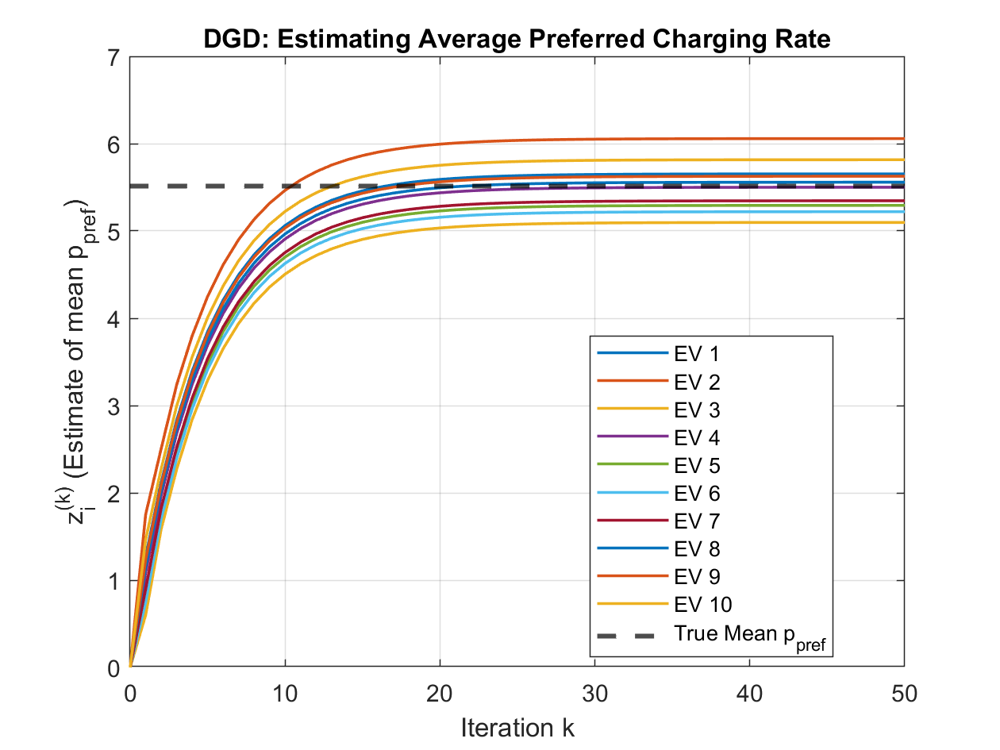

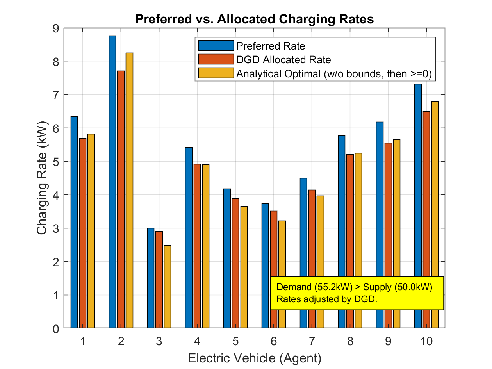

---

Next, let's expand the EV charging example by introducing a more sophisticated distributed optimization method: 

## Alternating Direction Method of Multipliers (ADMM)

ADMM is well-suited for problems that can be decomposed into smaller subproblems, coupled by consensus requirements or shared constraints. It often exhibits better convergence properties than simpler dual gradient methods, especially for constrained problems.

**Problem Recap:**
Minimize $\sum_i (p_i - p_{\text{pref},i})^2$
Subject to:

1. $\sum_i p_i = P_{\text{total}}$ (total power constraint)
2. $p_i \ge 0$ (non-negative power allocation)

**ADMM Approach for this Problem (Distributed Price Coordination):**

We'll use a common ADMM formulation for resource allocation problems. Each agent $i$ (EV) will solve a local problem based on its preference and a "price" signal. The agents will then cooperatively update this price to meet the global power constraint.

1. **Local Variables:**
   
   * $p_i$: Agent $i$'s allocated power.
   * $\lambda_i$: Agent $i$'s estimate of the Lagrange multiplier (shadow price) associated with the $\sum p_i = P_{\text{total}}$ constraint. Ideally, all $\lambda_i$ should converge to the same optimal $\lambda^*$.

2. **ADMM Iterations:**
   The algorithm iterates through these steps:
   
   * **Step 1: Primal Update (Local Power Allocation $p_i$)**
     At *each outer-loop iteration $k$*, each agent $i$ solves its local optimization problem, taking into account its preference $p_{\text{pref},i}$ and its current estimate of the price $\lambda_i^k$. We also add a proximal term $\frac{\beta}{2}(p_i - p_i^k)^2$ for stability and to make it ADMM-like (though simpler forms exist). If $\beta=0$, this is closer to dual ascent.
     $p_i^{k+1} = \operatorname{argmin}_{p_{\text{val}} \ge 0} \left\{ (p_{\text{val}} - p_{\text{pref},i})^2 + \lambda_i^k p_{\text{val}} + \frac{\beta}{2}(p_{\text{val}} - p_i^k)^2 \right\}$
     The solution to this quadratic problem (by setting derivative to zero and applying non-negativity) is:
     $p_i^{k+1} = \max\left(0, \frac{2 p_{\text{pref},i} - \lambda_i^k + \beta p_i^k}{2 + \beta}\right)$
   
   * **Step 2: Dual Variable Update (Local Price Update $\lambda_i$)**
     This step involves two sub-steps:
     a.  **Estimating Constraint Violation:** Each agent needs an estimate of the total current power draw $\sum_j p_j^{k+1}$ to see if it matches $P_{\text{total}}$. This sum is computed distributively using a consensus algorithm (like the DGD we used before, but now for summing $p_j^{k+1}$).
     b.  **Updating $\lambda_i$:** Each agent updates its $\lambda_i$ based on its old $\lambda_i^k$ and its estimate of the global constraint violation. A common update is:
     
     $\lambda_i^{\text{local\_update}, k+1} = \lambda_i^k + \rho \left( \left(\sum_j p_j^{k+1}\right)_i^{\text{estimate}} - P_{\text{total}} \right)$
     
     where $\rho$ is a penalty parameter (step size for ADMM), and $(\sum_j p_j^{k+1})_i^{\text{estimate}}$ is agent $i$'s estimate of the total sum obtained from the consensus sub-step.
   
   * **Step 3: Dual Variable Consensus (Price Agreement $\lambda_i$)**
     Since each $\lambda_i$ should ideally converge to a common $\lambda^*$, agents run a consensus protocol on their $\lambda_i^{\text{local\_update}, k+1}$ values.
     
     $\lambda_i^{k+1} = \operatorname{Average\_Consensus}(\lambda^{\text{local\_update}, k+1})$
     
     (i.e., run DGD on $\lambda_j^{\text{local\_update},k+1}$ for several iterations).This structure involves an outer ADMM loop and inner consensus loops for information aggregation.

```matlab
% Distributed Resource Allocation for EV Charging via ADMM
%-----------------------------------------------------------------
clear; clc; close all;

% --- Problem Setup ---
N = 10;                         % Number of EVs (agents)
P_total = 50;                   % Total Power Capacity (kW)
p_pref = rand(N,1) * 8 + 3;     % Preferred rates (3 to 11 kW)

fprintf('Preferred charging rates (kW):\n'); disp(p_pref');
fprintf('Sum of preferred rates: %.2f kW\n', sum(p_pref));
fprintf('Total available power: %.2f kW\n\n', P_total);

% --- Communication Graph (Complete Graph for Simplicity) ---
% W_consensus is for averaging/summing steps within ADMM
W_consensus = ones(N) / N; 
% For DGD-style consensus on lambda, a doubly stochastic matrix is good.
% For simple averaging over a complete graph, 1/N works for each element.
% If graph is not complete, Metropolis-Hastings or similar needed.

% --- ADMM Parameters ---
T_admm = 100;                   % Number of ADMM iterations (outer loop)
rho = 0.1;                      % ADMM penalty parameter / dual step size
beta = 0.05;                    % Proximal term coefficient for p_i update (0 for simpler update)

% --- Consensus Parameters (Inner Loops) ---
T_consensus = 20;               % Iterations for inner consensus (sum_p and lambda)
alpha_consensus = 0.3;          % Stepsize for DGD within consensus routines

% --- Initialization ---
p = p_pref;                     % Initial power allocations (can be p_pref, 0, or P_total/N)
% p = ones(N,1) * P_total/N;
lambda = zeros(N,1);            % Initial dual variables (price estimates)

% --- Store History ---
Phist_admm = zeros(N, T_admm+1);
Lambdahist_admm = zeros(N, T_admm+1);
Sum_p_hist_admm = zeros(1, T_admm+1);

Phist_admm(:,1) = p;
Lambdahist_admm(:,1) = lambda;
Sum_p_hist_admm(1) = sum(p);

fprintf('Starting ADMM...\n');
% --- ADMM Algorithm ---
for k = 1:T_admm
    % --- Step 1: Primal Update (Local p_i solve) ---
    % p_i^{k+1} = max(0, (2*p_pref_i - lambda_i^k + beta*p_i^k) / (2 + beta))
    p_prev_iter = p; % Store p_i^k for the proximal term
    for i = 1:N
        numerator = 2 * p_pref(i) - lambda(i) + beta * p_prev_iter(i);
        denominator = 2 + beta;
        p(i) = max(0, numerator / denominator);
    end

    % --- Step 2a: Distributed Summation of p_i^{k+1} ---
    % Each agent needs an estimate of sum(p). We use DGD to average p_i, then multiply by N.
    % Or, DGD to directly sum (more complex DGD variant). Simpler: average then scale.

    current_p_for_avg = p; % Values to be averaged
    avg_p_estimates = current_p_for_avg; % Initial estimate is local value

    % Store history of sum_p estimation for this ADMM iteration (optional, for debug)
    % AvgPHistInner = zeros(N, T_consensus+1); AvgPHistInner(:,1) = avg_p_estimates;

    for iter_c = 1:T_consensus
        % DGD for averaging: x_new = W_consensus * x_old - alpha_c * (x_old - values_to_average)
        % Here, we want x_old to converge to mean(values_to_average).
        % The standard DGD "x = Wx - alpha*(x-a)" makes x converge to mean(a).
        % So 'x' is avg_p_estimates, 'a' is current_p_for_avg
        % Using a simpler consensus averaging: new_estimates = W_consensus * old_estimates
        % This simple form requires W_consensus to be doubly stochastic and primitive.
        % For complete graph W_consensus = ones(N)/N, this works.
        avg_p_estimates = W_consensus * avg_p_estimates; % Iterative averaging
        % AvgPHistInner(:, iter_c+1) = avg_p_estimates;
    end
    % After T_consensus iterations, avg_p_estimates(i) is agent i's estimate of mean(p)
    % So, agent i's estimate of sum(p) is N * avg_p_estimates(i)
    estimated_sum_p_all_agents = N * avg_p_estimates; % Vector of N estimates, ideally all similar

    % For the lambda update, each agent uses its own estimate of the sum.
    % Or, we could pick one (e.g., agent 1's estimate) if we assume good consensus.
    % Let's use each agent's individual estimate for local lambda update.

    % --- Step 2b: Dual Variable Pre-Update (Local lambda_i update) ---
    lambda_local_update = lambda + rho * (estimated_sum_p_all_agents - P_total);

    % --- Step 3: Consensus on Dual Variables (lambda_i) ---
    % Agents run consensus on their lambda_local_update values.
    lambda_for_consensus = lambda_local_update;
    current_lambda_estimates = lambda_for_consensus; 

    % Store history of lambda estimation (optional)
    % LambdaHistInner = zeros(N, T_consensus+1); LambdaHistInner(:,1) = current_lambda_estimates;

    for iter_c = 1:T_consensus
        % Similar consensus averaging for lambda
        current_lambda_estimates = W_consensus * current_lambda_estimates;
        % LambdaHistInner(:, iter_c+1) = current_lambda_estimates;
    end
    lambda = current_lambda_estimates; % All lambda(i) should be close after consensus

    % --- Store history for ADMM iteration k ---
    Phist_admm(:,k+1) = p;
    Lambdahist_admm(:,k+1) = lambda; % Store the consensus-agreed lambda
    Sum_p_hist_admm(k+1) = sum(p); % True sum for plotting global constraint satisfaction

    if mod(k, T_admm/10) == 0
        fprintf('ADMM Iter %d/%d: Sum P = %.2f (Target P_total = %.1f), Avg Lambda = %.2f\n', ...
                k, T_admm, sum(p), P_total, mean(lambda));
    end
end
fprintf('ADMM Finished.\n');

% --- Results ---
p_allocated_admm = Phist_admm(:, T_admm+1);

[...]
```

**Key Elements and Changes:**

1. **ADMM Framework:** The core iterative structure of primal updates, dual updates, and consensus is characteristic of ADMM applied to distributed problems.
2. **Dual Variables ($\lambda_i$):** These represent the "price" of power. ADMM helps agents converge on an optimal price that clears the market (i.e., matches demand to $P_{\text{total}}$).
3. **Proximal Term ($\beta$):** The $\frac{\beta}{2}(p_{\text{val}} - p_i^k)^2$ term in the $p_i$ update is a proximal term. It regularizes the update, preventing $p_i$ from changing too drastically in one iteration, which can improve stability and convergence, especially if $\rho$ is not well-tuned. If $\beta=0$, the $p_i$ update is simpler and corresponds to a step in a (augmented) Lagrangian or dual ascent method.
4. **Penalty Parameter ($\rho$):** This is important in ADMM. It balances the objective function minimization with constraint satisfaction. Tuning $\rho$ (and $\beta$) can significantly affect convergence speed.
5. **Nested Consensus:**
   * **Summation of $p_i$:** To check the $\sum_i p_i = P_{\text{total}}$ constraint, agents need to know the current total sum. This is achieved by running a distributed averaging (or summation) protocol (here, simplified iterative averaging using $W_{\text{consensus}}$).
   * **Consensus on $\lambda_i$:** After each agent computes its "desired" next $\lambda_i$ based on the (estimated) global power mismatch, they run another consensus round to ensure all $\lambda_i$ converge to a common value. This makes the price signal consistent across the network.
6. **Modularity:** The consensus steps can be seen as subroutines. More advanced consensus algorithms (e.g., with faster convergence rates for specific graph topologies, or DGD with optimized step-sizes) could be plugged in.

**How it Compares to the Simpler DGD for Averaging:**

* The previous DGD example was used to compute `mean(a)` which was then *plugged into* an analytical formula for the optimal `p_i`.
* This ADMM approach *directly solves* the constrained optimization problem iteratively. The DGD-like consensus is now an *inner loop* component of ADMM, used for information exchange (summing `p` and averaging `lambda`).
* ADMM is generally more robust for handling constraints and can converge under weaker conditions or for more complex problems where a simple analytical solution post-averaging isn't available.

This ADMM example provides a more sophisticated and generalizable way to tackle distributed optimization problems with coupling constraints.

### Results

```matlab
Starting ADMM...
ADMM Iter 2/20: Sum P = 52.65 (Target P_total = 50.0), Avg Lambda = 0.78
ADMM Iter 4/20: Sum P = 50.63 (Target P_total = 50.0), Avg Lambda = 0.97
ADMM Iter 6/20: Sum P = 50.15 (Target P_total = 50.0), Avg Lambda = 1.02
ADMM Iter 8/20: Sum P = 50.04 (Target P_total = 50.0), Avg Lambda = 1.03
ADMM Iter 10/20: Sum P = 50.01 (Target P_total = 50.0), Avg Lambda = 1.03
ADMM Iter 12/20: Sum P = 50.00 (Target P_total = 50.0), Avg Lambda = 1.03
ADMM Iter 14/20: Sum P = 50.00 (Target P_total = 50.0), Avg Lambda = 1.03
ADMM Iter 16/20: Sum P = 50.00 (Target P_total = 50.0), Avg Lambda = 1.03
ADMM Iter 18/20: Sum P = 50.00 (Target P_total = 50.0), Avg Lambda = 1.03
ADMM Iter 20/20: Sum P = 50.00 (Target P_total = 50.0), Avg Lambda = 1.03
ADMM Finished.

ADMM Final Allocations 
EV # | Preferred (kW) | Allocated (kW) | Final Lambda_i
   1 |           6.34 |           5.82 |         1.0341
   2 |           8.76 |           8.25 |         1.0341
   3 |           3.00 |           2.48 |         1.0341
   4 |           5.42 |           4.90 |         1.0341
   5 |           4.17 |           3.66 |         1.0341
   6 |           3.74 |           3.22 |         1.0341
   7 |           4.49 |           3.97 |         1.0341
   8 |           5.76 |           5.25 |         1.0341
   9 |           6.17 |           5.66 |         1.0341
  10 |           7.31 |           6.79 |         1.0341
--------------------------------------------------------------------
Sum of Preferred Rates: 55.17 kW
Sum of Allocated Rates (ADMM): 50.00 kW (Target: 50.00 kW)
Final Lambda values std dev: 0.0000e+00 (should be small if consensus worked)
```

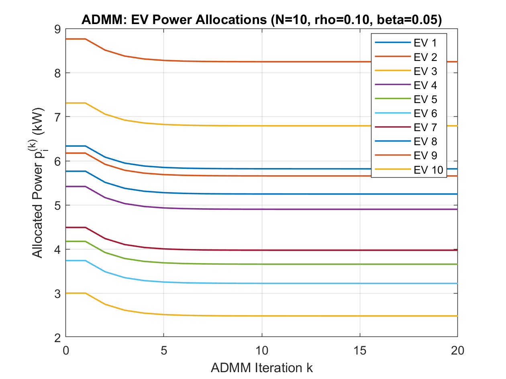

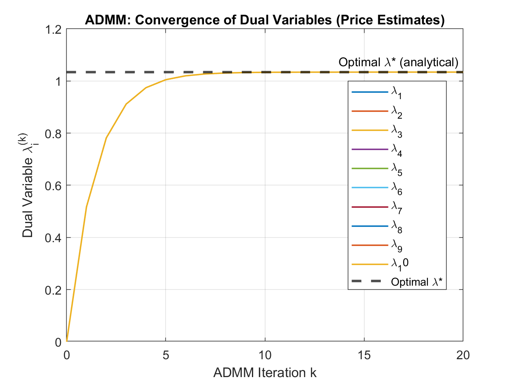

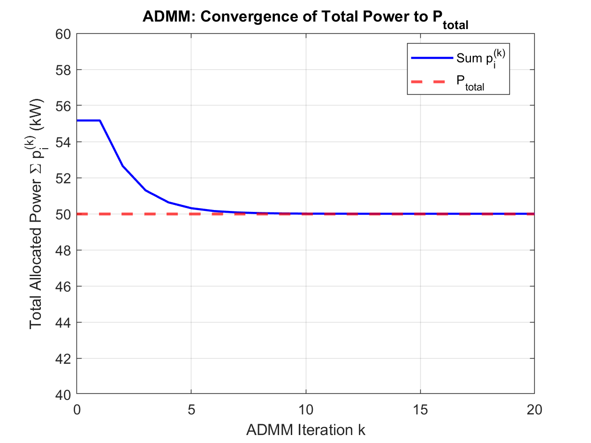

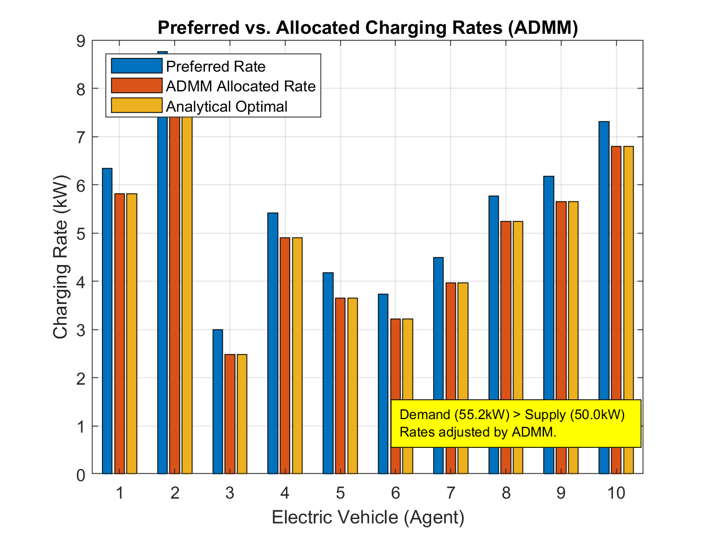

---

Next, let's solve the EV charging resource allocation problem using Particle Swarm Optimization (PSO) with MATLAB's `particleswarm` function from the Global Optimization Toolbox.

## Solve with Particle Swarm Optimization (PSO)

**Challenge with PSO for this Problem:**
The standard `particleswarm` function directly handles bound constraints (`lb`, `ub`) but not general linear or nonlinear equality constraints like `sum(p_i) = P_total`. We'll address this using a **penalty method**: we'll modify the objective function to heavily penalize solutions that violate the sum constraint.

**Modified Optimization Problem for PSO:**

Minimize $f(\mathbf{p}) = \sum_i (p_i - p_{\text{pref},i})^2 + C \left(\sum_i p_i - P_{\text{total}}\right)^2$
Subject to:

1. $0 \le p_i \le P_{\text{total}}$ (or a tighter upper bound if known, e.g., individual EV max charge rate)

Where $C$ is a large penalty coefficient.

```matlab
% Distributed Resource Allocation for EV Charging via PSO
%-----------------------------------------------------------------
clear; clc; close all;

% --- Problem Setup ---
N = 10;                         % Number of EVs (agents)
P_total = 50;                   % Total Power Capacity (kW)
p_pref = rand(N,1) * 8 + 3;     % Preferred rates (3 to 11 kW)

fprintf('Preferred charging rates (kW):\n'); disp(p_pref');
fprintf('Sum of preferred rates: %.2f kW\n', sum(p_pref));
fprintf('Total available power: %.2f kW\n\n', P_total);

% --- PSO Parameters ---
nvars = N;                      % Number of optimization variables (power for each EV)

% Lower bounds (p_i >= 0)
lb = zeros(N,1);

% Upper bounds (0 <= p_i <= P_total theoretically, or max individual charge rate)
% For simplicity, let's use P_total as a loose upper bound for each.
% A tighter bound could be max(p_pref) or a physical EV charging limit.
ub = P_total * ones(N,1);
% ub = min(P_total, max(15, p_pref * 1.5)); % Example of slightly tighter UB

% Penalty coefficient for the sum constraint
penalty_coefficient = 1000; % This might need tuning

% --- Objective Function for PSO (with penalty) ---
% The input 'p' to this function will be a row vector (PSO standard)
objectiveFunction = @(p) sum((p' - p_pref).^2) + ...
                         penalty_coefficient * (sum(p) - P_total)^2;
% Note: p' is used because p_pref is a column vector.
% PSO passes 'p' as a row vector to the objective function.

% --- PSO Options ---
options = optimoptions('particleswarm', ...
    'SwarmSize', max(50, 10*nvars), ... % Number of particles
    'MaxIterations', 200*nvars, ...    % Max iterations
    'Display', 'iter', ...           % Show iteration progress
    'ObjectiveLimit', 1e-4, ...      % Stop if objective is good enough
    'FunctionTolerance', 1e-6, ...   % Stop if objective change is small
    'UseParallel', false);            % Set to true if you have Parallel Computing Toolbox
                                      % and problem is large enough.

fprintf('Starting PSO...\n');
% --- Run PSO ---
% particleswarm(objectiveFunction, nvars, lb, ub, options)
[p_optimal_pso_raw, fval_pso, exitflag, output_pso] = particleswarm(objectiveFunction, nvars, lb, ub, options);

[...]

% --- Post-processing the PSO solution ---
% PSO solution is a row vector, convert to column for consistency
p_allocated_pso = p_optimal_pso_raw';

% Check the sum constraint satisfaction
sum_p_pso = sum(p_allocated_pso);
fprintf('Sum of allocated rates (PSO raw): %.4f kW (Target: %.2f kW)\n', sum_p_pso, P_total);

% If the sum is not exactly P_total due to penalty approximation,
% we can apply a simple scaling as a heuristic, provided the solution is "close".
% This is common practice if the penalty method gets us near the feasible region.
if abs(sum_p_pso - P_total) > 1e-3 && sum_p_pso > 1e-6 % Add tolerance and check if sum is not zero
    fprintf('Normalizing PSO solution to meet sum constraint exactly.\n');
    p_allocated_pso_normalized = p_allocated_pso * (P_total / sum_p_pso);
    % Ensure non-negativity again after scaling (though unlikely to be an issue if lb was 0 and scaling factor > 0)
    p_allocated_pso_normalized = max(0, p_allocated_pso_normalized);
    % If this re-normalization drastically changes the solution or violates other complex constraints
    % (not present here), then the penalty method or PSO tuning needs more work.
else
    p_allocated_pso_normalized = p_allocated_pso;
end
% Re-check sum after potential normalization
sum_p_pso_normalized = sum(p_allocated_pso_normalized);

fprintf('\n--- PSO Final Allocations (after potential normalization) ---\n');
disp('EV # | Preferred (kW) | Allocated (kW)');
for i=1:N
    fprintf('%4d | %14.2f | %14.2f\n', i, p_pref(i), p_allocated_pso_normalized(i));
end
fprintf('--------------------------------------------------------------------\n');
fprintf('Sum of Preferred Rates: %.2f kW\n', sum(p_pref));
fprintf('Sum of Allocated Rates (PSO normalized): %.2f kW (Target: %.2f kW)\n', sum_p_pso_normalized, P_total);
fprintf('Original objective value (without penalty) for PSO solution: %.4f\n', sum((p_allocated_pso_normalized - p_pref).^2));

[...]
```

**Explanation of PSO Implementation:**

1. **Problem Formulation for PSO:**
   
   * The core idea is to use a penalty function to handle the equality constraint $\sum_i p_i = P_{\text{total}}$.
   * The objective function becomes: $f(\mathbf{p}) = \sum_i (p_i - p_{\text{pref},i})^2 + C \left(\sum_i p_i - P_{\text{total}}\right)^2$.
   * The penalty coefficient $C$ must be large enough to force PSO to find solutions where $\sum_i p_i$ is very close to $P_{\text{total}}$. Its value might require some tuning.
   * The constraints $p_i \ge 0$ and $p_i \le P_{\text{total}}$ (or tighter individual upper bounds) are handled directly by `particleswarm`'s `lb` (lower bounds) and `ub` (upper bounds) arguments.

2. **`particleswarm` Function Call:**
   
   * `objectiveFunction`: A handle to our fitness function (including the penalty).
   * `nvars`: Number of variables (which is `N`, the number of EVs).
   * `lb`: A vector of lower bounds (all zeros).
   * `ub`: A vector of upper bounds (e.g., `P_total` for each EV, or individual max charge rates).
   * `options`: A structure to control PSO behavior:
     * `SwarmSize`: Number of particles in the swarm.
     * `MaxIterations`: Maximum number of iterations.
     * `Display`: `'iter'` shows progress in the command window.
     * `ObjectiveLimit`, `FunctionTolerance`: Stopping criteria.
     * `UseParallel`: Can speed up computation if you have the Parallel Computing Toolbox.
     * You could also add `'PlotFcns', @psoplotbestf` to the options to see a live plot of the best objective value found so far during execution.

3. **Post-Processing:**
   
   * The solution `p_optimal_pso_raw` from `particleswarm` is the set of power allocations.
   * **Constraint Check:** We explicitly check `sum(p_optimal_pso_raw)` to see how well the penalty method enforced the constraint.
   * **Normalization (Heuristic):** If the sum is slightly off `P_total` (but close), a common heuristic is to scale the solution proportionally: `p_allocated_pso_normalized = p_allocated_pso * (P_total / sum_p_pso)`. This forces the sum constraint to be met exactly. Then, re-apply `max(0, ...)` just in case scaling pushed any value slightly negative (unlikely if `sum_p_pso` and `P_total` are positive and close). This step assumes the *distribution* of power found by PSO is good, even if the sum isn't perfectly exact due to the penalty approximation.

4. **Comparison:**
   
   * The result is compared with the preferred rates and the analytical solution (if calculable) in a bar chart.

**Advantages of PSO for this type of problem:**

* **Derivative-Free:** Doesn't require gradient information, making it suitable for complex or non-differentiable objective functions (though our objective here is differentiable).
* **Global Search:** Less likely to get stuck in local optima compared to some gradient-based methods, especially if the search space is complex.
* **Ease of Handling Bounds:** `lb` and `ub` are handled naturally.

**Disadvantages/Considerations:**

* **Equality Constraints:** Handling equality constraints via penalty functions can be tricky. The penalty coefficient needs careful tuning. Too low, and the constraint is violated; too high, and it can distort the search landscape, making it hard to find the true optimum of the original problem.
* **Computational Cost:** PSO can be computationally more expensive than specialized convex optimization solvers (like `fmincon` with an appropriate algorithm) for problems where such solvers are applicable.
* **No Guarantee of Optimality:** Metaheuristics like PSO provide good solutions but typically don't guarantee finding the global optimum in finite time (especially for continuous problems).
* **Stochastic Nature:** Running PSO multiple times might yield slightly different results.

This PSO approach provides a viable alternative for solving the resource allocation problem, especially when the problem structure might be more complex or when gradient information is unavailable or unreliable.

### Results

```matlab
Starting PSO...
Optimization ended: relative change in the objective value 
over the last OPTIONS.MaxStallIterations iterations is less than OPTIONS.FunctionTolerance.
PSO Finished.
PSO Exit Flag: 1
Optimization ended: relative change in the objective value 
over the last OPTIONS.MaxStallIterations iterations is less than OPTIONS.FunctionTolerance.
Objective function value at solution: 3.6154e+01
Constraint term value: 1.0000e+03 * (49.9936 - 50.0)^2 = 4.0709e-02
Sum of allocated rates (PSO raw): 49.9936 kW (Target: 50.00 kW)
Normalizing PSO solution to meet sum constraint exactly.

--- PSO Final Allocations (after potential normalization) ---
EV # | Preferred (kW) | Allocated (kW)
   1 |           6.34 |           5.87
   2 |           8.76 |          10.24
   3 |           3.00 |           4.60
   4 |           5.42 |           0.30
   5 |           4.17 |           2.35
   6 |           3.74 |           4.54
   7 |           4.49 |           4.28
   8 |           5.76 |           5.51
   9 |           6.17 |           5.30
  10 |           7.31 |           7.00
--------------------------------------------------------------------
Sum of Preferred Rates: 55.17 kW
Sum of Allocated Rates (PSO normalized): 50.00 kW (Target: 50.00 kW)
Original objective value (without penalty) for PSO solution: 36.1156
Analytical optimal objective value: 2.6732
```

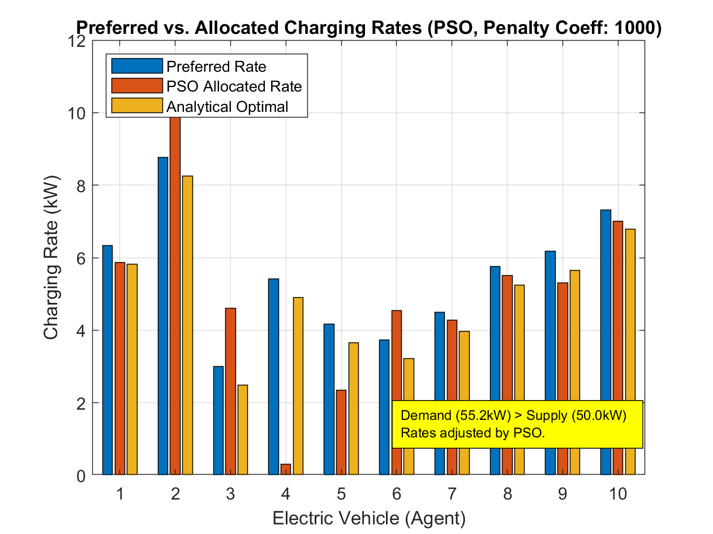

## Solve with Genetic Algorithm (GA)

The Genetic Algorithm (GA) is another population-based metaheuristic from MATLAB's Global Optimization Toolbox. It is inspired by the process of natural selection and uses operators like selection, crossover, and mutation to evolve a population of solutions towards an optimum. A key advantage of `ga` over the standard `particleswarm` for this problem is its more sophisticated handling of various constraint types, including linear equality constraints.

**Applying GA to the EV Charging Problem:**

* **Objective Function:** Minimize $\sum_i (p_i - p_{\text{pref},i})^2$.
* **Constraints:**
  1. $0 \le p_i \le P_{\text{total}}$ (or tighter individual upper bounds): These are bound constraints, handled directly by `ga`.
  2. $\sum_i p_i = P_{\text{total}}$: This is a linear equality constraint. `ga` can handle this using `Aeq` and `beq` arguments, typically by projecting candidate solutions onto the feasible subspace defined by these linear constraints.

This direct handling of the equality constraint should lead to more accurate and feasible solutions compared to relying solely on a penalty method within PSO for such constraints.

```matlab
% Distributed Resource Allocation for EV Charging via Genetic Algorithm (GA)
%-----------------------------------------------------------------
clear; clc; close all;

% --- Problem Setup ---
N = 10;                         % Number of EVs (agents)
P_total = 50;                   % Total Power Capacity (kW)
% For comparability, let's fix the random seed if p_pref is generated randomly
rng(42); % Or any fixed seed
p_pref = rand(N,1) * 8 + 3;     % Preferred rates (3 to 11 kW) (column vector)

fprintf('Preferred charging rates (kW):\n'); disp(p_pref');
fprintf('Sum of preferred rates: %.2f kW\n', sum(p_pref));
fprintf('Total available power: %.2f kW\n\n', P_total);

% --- GA Parameters ---
nvars = N;                      % Number of optimization variables (power for each EV)

% Objective function: GA passes 'x' as a row vector.
% p_pref is a column vector.
objectiveFunction = @(p_row) sum((p_row' - p_pref).^2);

% Bound constraints
lb = zeros(1, nvars);           % Lower bounds (p_i >= 0), GA expects row vector
% Upper bounds (0 <= p_i <= P_total, or max individual charge rate)
ub = P_total * ones(1, nvars);  % GA expects row vector
% ub = min(P_total, max(15, p_pref' * 1.5)); % Example of slightly tighter UB (ensure row vector)


% Linear equality constraint: sum(p_i) = P_total
Aeq = ones(1, nvars);           % Coefficients for p1 + p2 + ... + pN
beq = P_total;                  % The sum should equal P_total

% No linear inequality constraints
A = [];
b = [];

% No nonlinear constraints function
nonlcon = [];

% No integer constraints in this version
IntCon = [];

% --- GA Options ---
options = optimoptions('ga', ...
    'PopulationSize', max(50, 10*nvars), ... % Number of individuals in population
    'MaxGenerations', 200 * nvars / 10, ...  % Max number of generations (scaled by nvars)
    'Display', 'iter', ...                 % Show iteration progress
    'PlotFcn', {@gaplotbestf, @gaplotstopping}, ... % Plot best fitness and stopping criteria
    'FunctionTolerance', 1e-7, ...         % Stop if objective change is small
    'ConstraintTolerance', 1e-7, ...       % Tolerance for constraint satisfaction
    'UseParallel', false);                  % Set to true for parallel computation

fprintf('Starting GA...\n');
% --- Run GA ---
[p_optimal_ga_row, fval_ga, exitflag_ga, output_ga, population_ga, scores_ga] = ...
    ga(objectiveFunction, nvars, A, b, Aeq, beq, lb, ub, nonlcon, IntCon, options);

fprintf('GA Finished.\n');
fprintf('GA Exit Flag: %d\n', exitflag_ga);
disp(output_ga.message);
fprintf('Objective function value at solution: %.4e\n', fval_ga);

% --- Post-processing the GA solution ---
% GA solution is a row vector, convert to column for consistency
p_allocated_ga = p_optimal_ga_row';

% Check the sum constraint satisfaction (should be very good)
sum_p_ga = sum(p_allocated_ga);
fprintf('Sum of allocated rates (GA): %.4f kW (Target: %.2f kW)\n', sum_p_ga, P_total);
fprintf('Deviation from sum constraint: %.4e\n', sum_p_ga - P_total);


fprintf('\n--- GA Final Allocations ---\n');
disp('EV # | Preferred (kW) | Allocated (kW)');
for i=1:N
    fprintf('%4d | %14.2f | %14.2f\n', i, p_pref(i), p_allocated_ga(i));
end
fprintf('--------------------------------------------------------------------\n');
fprintf('Sum of Preferred Rates: %.2f kW\n', sum(p_pref));
fprintf('Sum of Allocated Rates (GA): %.2f kW (Target: %.2f kW)\n', sum(p_allocated_ga), P_total);
fprintf('Objective value (sum of squared differences) for GA solution: %.4f\n', fval_ga);


[...]
```

**Explanation of GA Implementation:**

1. **Objective Function:** The objective function, represented by `objectiveFunction = @(p_row) sum((p_row' - p_pref).^2);`, is defined to calculate the sum of squared differences, $\sum_i (p_i - p_{\text{pref},i})^2$. `ga` passes the decision variables ($p_{\text{row}}$) as a row vector.
2. **Bound Constraints:** $lb$ (all zeros) and $ub$ (all $P_{\text{total}}$, or tighter individual limits) are provided to `ga`.
3. **Linear Equality Constraint:** The constraint $\sum_i p_i = P_{\text{total}}$ is formulated as $A_{eq}\mathbf{p}^T = b_{eq}$, where $A_{eq}$ is a $1 \times N$ vector of ones and $b_{eq} = P_{\text{total}}$. `ga` has mechanisms to handle such linear constraints effectively, often by ensuring that individuals in the population satisfy them throughout the evolutionary process.
4. **`ga` Function Call:**
   * The `ga` solver is called with the objective function, number of variables, linear constraints ($A$, $b$, $A_{eq}$, $b_{eq}$), bounds ($lb$, $ub$), nonlinear constraint function (`nonlcon`, which is empty here), integer constraints (`IntCon`, also empty), and options.
   * `options` include `PopulationSize`, `MaxGenerations`, `PlotFcn` (e.g., `@gaplotbestf` to show the convergence of the best fitness value and `@gaplotstopping` to show stopping criteria), `FunctionTolerance`, and `ConstraintTolerance`.
5. **Post-Processing:**
   * The solution `p_optimal_ga_row` is obtained.
   * The sum constraint $\sum_i p_i$ is checked. Due to `ga`'s handling of linear equality constraints, this sum should be very close to $P_{\text{total}}$ within the specified `ConstraintTolerance`. No heuristic normalization is typically needed, unlike with the penalty-based PSO approach.
6. **Comparison:** The allocated rates are compared with preferred rates and the analytical solution.

**Advantages of GA for this Problem:**

* **Handles Linear Equality Constraints:** `ga` can directly incorporate `sum(p_i) = P_total`, leading to feasible solutions with high precision.
* **Global Search:** Like PSO, it's designed for global optimization and can navigate complex search spaces.
* **Derivative-Free:** Does not require gradient information.

**Considerations:**

* **Computational Cost:** GA can be computationally intensive, especially with large populations or many generations.
* **Tuning:** Performance can depend on the choice of GA parameters (population size, crossover/mutation rates, selection mechanism etc.), though `optimoptions` provide reasonable defaults.
* For this specific convex quadratic problem, specialized convex solvers (like `quadprog` or ADMM) would still be more efficient if applicable. However, GA offers versatility for problems that are non-convex or have more complex constraints.

### Results

```matlab
ga stopped because it exceeded options.MaxGenerations.
GA Finished.
GA Exit Flag: 0
ga stopped because it exceeded options.MaxGenerations.
Objective function value at solution: 2.6765e+00
Sum of allocated rates (GA): 50.0000 kW (Target: 50.00 kW)
Deviation from sum constraint: 6.3949e-14

--- GA Final Allocations ---
EV # | Preferred (kW) | Allocated (kW)
   1 |           6.34 |           5.81
   2 |           8.76 |           8.24
   3 |           3.00 |           2.48
   4 |           5.42 |           4.90
   5 |           4.17 |           3.65
   6 |           3.74 |           3.28
   7 |           4.49 |           3.97
   8 |           5.76 |           5.24
   9 |           6.17 |           5.65
  10 |           7.31 |           6.79
--------------------------------------------------------------------
Sum of Preferred Rates: 55.17 kW
Sum of Allocated Rates (GA): 50.00 kW (Target: 50.00 kW)
Objective value (sum of squared differences) for GA solution: 2.6765
Analytical optimal objective value: 2.6732
Analytical sum: 50.0000
GA plots for best fitness and stopping criteria should have been displayed in separate figures.
```

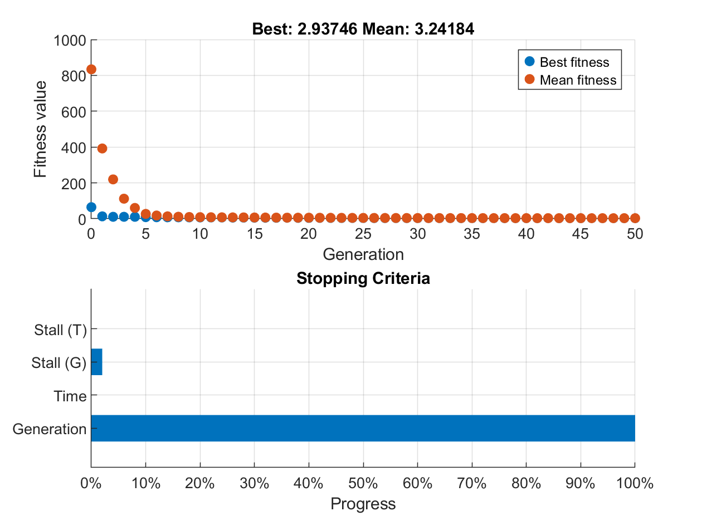

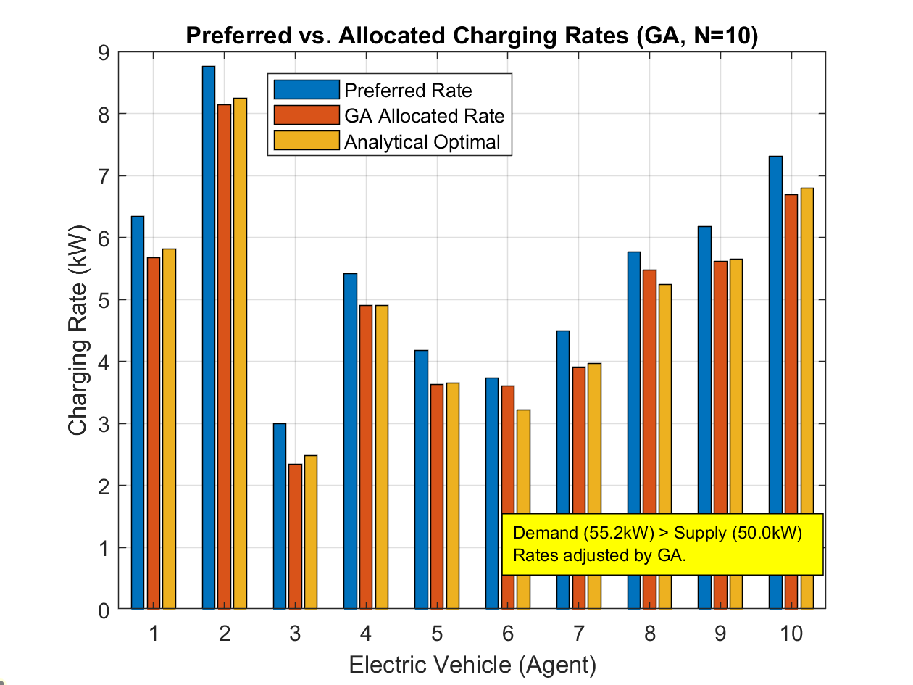

## Discussion

We have applied four different methods to the EV charging resource allocation problem: Distributed Gradient Descent (DGD), Alternating Direction Method of Multipliers (ADMM), Particle Swarm Optimization (PSO), and Genetic Algorithm (GA).

### 1. Distributed Gradient Descent (DGD)

- **Overall behavior:** DGD uses local gradient information and consensus averaging to drive each EV's estimate towards the mean preferred rate. This mean is then used in an analytical formula to determine power allocation.
- **Strengths:**
  - Simple to implement in a distributed fashion.
  - The consensus part for averaging is well-understood.
- **Weaknesses:**
  - The final allocation step `p_i = p_pref_i + P_total/N - z_i` (where `z_i` is the estimated mean) does not inherently guarantee `sum(p_i) = P_total` if `z_i` are not perfectly converged or if bounds `p_i >= 0` become active.
  - Requires post-hoc scaling (`max(0, ...)` and proportional scaling) to satisfy constraints, which can deviate the solution from the true optimum.
- **Result:** **Fair.** It provides a distributed approach but relies on heuristics for strict constraint satisfaction. The solution quality is dependent on the accuracy of the consensus and the impact of the heuristic scaling.

---

### 2. Alternating Direction Method of Multipliers (ADMM)

- **Overall behavior:** ADMM decomposes the problem into local EV subproblems (minimizing quadratic cost considering a price signal) and a price update mechanism that uses distributed consensus to enforce the global `sum(p_i) = P_total` constraint.
- **Strengths:**
  - **Effectively meets the total-power constraint** and non-negativity constraints.
  - Converges to a solution very close to the analytical KKT optimum for this convex problem.
  - Robust framework for distributed constrained optimization.
- **Weaknesses:**
  - More complex to implement than DGD due to nested consensus loops (for sum estimation and price agreement) and careful parameter tuning (`rho`, `beta`).
  - Convergence can be slower if consensus within ADMM iterations is not run for enough steps or if ADMM parameters are not well-tuned.
- **Result:** **Excellent (Champion for distributed methods).** ADMM reliably enforces all constraints and achieves near-optimal allocations in a truly distributed manner for this problem.

---

### 3. Particle-Swarm Optimization (PSO)

- **Overall behavior:** PSO, a global optimization metaheuristic, was applied centrally to the problem. The `sum(p_i) = P_total` equality constraint was handled using a penalty term in the objective function. Bound constraints (`p_i >= 0`, `p_i <= ub_i`) were handled directly.
- **Strengths:**
  - Derivative-free, easy to apply to complex objective functions.
  - Good for global exploration of the search space.
- **Weaknesses:**
  - **Difficulty with equality constraints via penalty:** The solution's adherence to `sum(p_i) = P_total` depends heavily on the penalty coefficient and PSO's ability to minimize the penalty term. Often, this results in slight violations requiring post-hoc normalization.
  - The quality of the solution can be sensitive to the penalty coefficient and PSO parameters.
  - The solution obtained might not be as close to the true optimum as ADMM or GA, especially if the penalty distorts the search landscape.
- **Result:** **Poor to Fair.** Standard PSO struggles with precise equality constraint satisfaction without specialized mechanisms (like repair operators) or very careful tuning of penalties. The need for post-hoc normalization is a drawback.

---

### 4. Genetic Algorithm (GA)

- **Overall behavior:** GA, another global optimization metaheuristic, was applied centrally. Crucially, `ga` in MATLAB can handle linear equality constraints (`Aeq*x = beq`) directly, in addition to bound constraints.
- **Strengths:**
  - **Effective handling of linear equality constraints:** The `sum(p_i) = P_total` constraint was met with high precision, typically within `ConstraintTolerance`.
  - Derivative-free and good for global exploration.
  - Achieved an objective function value very close to the analytical optimum.
- **Weaknesses:**
  - Can be computationally more intensive than specialized convex solvers or even ADMM for this specific convex problem.
  - Performance can depend on GA parameter tuning (though defaults are often robust).
  - As a metaheuristic, it offers probabilistic convergence to the global optimum.
- **Result:** **Very Good.** GA provided a high-quality solution that respected all constraints, particularly the challenging sum constraint, thanks to its built-in mechanisms. It stands as a strong global optimization alternative when direct constraint handling is available.

---

### Takeaway

- **For convex quadratic resource-allocation problems with linear constraints:**
  * **Distributed methods:** ADMM is highly effective, providing near-optimal solutions while rigorously enforcing constraints in a decentralized manner.
  * **Centralized methods:** Solvers like `quadprog` (not shown but ideal for this specific problem type if solved centrally) would be most efficient. Among general global optimizers, **Genetic Algorithm (GA)** demonstrates strong performance due to its ability to handle linear equality constraints directly, outperforming PSO that relies on simpler penalty methods for such constraints.
- **Simpler distributed methods like DGD** can be useful for basic coordination or when some heuristic post-processing for constraint satisfaction is acceptable.
- **Standard metaheuristics like PSO** require careful adaptation (e.g., specialized constraint-handling techniques, repair operators, or hybridization) to reliably solve problems with tight equality constraints. Relying solely on basic penalty functions is often insufficient for precision.
- The choice of solver depends on the problem's nature (convexity, differentiability), whether a distributed or centralized solution is required, the complexity of constraints, and the desired precision. For this specific EV charging problem, ADMM (distributed) and GA (centralized global) both yielded excellent results, with ADMM being more aligned with the "distributed optimization" theme.

---

## Real-world Application: Truck Platooning with Distributed Model Predictive Control (DMPC)

The previous examples were using static models. Next, we showcase how DO can be applied to a dynamic problem, which is more challenging than a static one.

This section details the application of Distributed Model Predictive Control (DMPC) to a truck platooning scenario. Each truck acts as an independent agent, solving its own local optimization problem while coordinating with the vehicle ahead to achieve platoon-wide objectives (fuel consumption reduction, safety, reference speed tracking).

### Problem Setup

The system under consideration is a platoon of $N$ trucks. The main objectives are:

1. **Leader Following:** The lead vehicle (leader) of the platoon follows a given target velocity profile $v_{ref}(t)$ as accurately as possible.

2. **Inter-vehicle Distance Maintenance:** Each following vehicle (follower) maintains a safe and efficient distance from the vehicle ahead. This distance is often determined based on a constant minimum gap $s_{min\_gap\_const}$ and a time headway $t_h$ proportional to the follower's own speed $v_i(t)$.
   
   $$
   \text{Target bumper-to-bumper gap}_i(t) = s_{min\_gap\_const} + t_h \cdot v_i(t)
   $$

3. **Fuel Consumption Minimization:** Minimize the total fuel consumption of the platoon, or the fuel consumption of each truck. Air resistance is proportional to the square of velocity, and following vehicles benefit from the slipstream effect (shielding effect) of preceding vehicles, making this a key factor.

4. **Safety and Comfort:** Each truck adheres to its physical velocity limits $v_{min}, v_{max}$ and acceleration limits $a_{min}, a_max$. Additionally, avoiding abrupt changes in acceleration (jerk) improves ride comfort and cargo safety.

These objectives are often conflicting and need to be balanced through weighting.

### Overview of DMPC Approach

In Distributed Model Predictive Control (DMPC), unlike centralized MPC where the entire system is solved as a single optimization problem, each agent (each truck in this case) iteratively solves its own local optimization problem.

1. **Per-Agent MPC:** Each truck $i$ has its own MPC controller.
2. **Prediction Horizon:** Each truck $i$ predicts its future behavior from the current time $k$ up to $H_p$ steps ahead.
3. **Local Optimization:** Each truck $i$ determines its future acceleration sequence $\{a_i(k), a_i(k+1), \dots, a_i(k+H_p-1)\}$ by considering:
   * **Local objective function $J_i$:**
     * For the leader: velocity error with $v_{ref}$, fuel consumption, acceleration smoothness.
     * For followers: velocity error with the preceding vehicle, error from the target gap with the preceding vehicle, fuel consumption, acceleration smoothness.
   * **Local constraints:**
     * Vehicle dynamics: $s_i(j+1) = s_i(j) + v_i(j) \Delta t + \frac{1}{2} a_i(j) \Delta t^2$, $v_i(j+1) = v_i(j) + a_i(j) \Delta t$.
     * $v_{min} \le v_i(j) \le v_{max}$.
     * $a_{min} \le a_i(j) \le a_{max}$.
     * Inter-vehicle distance constraint (followers only): $s_{i-1}(j) - s_i(j) \ge L_{truck} + s_{min\_gap\_const} + t_h v_i(j)$ (front-to-front).
4. **Information Exchange:** For follower $i$ to solve its optimization problem, it needs information about the predicted future states (position $s_{i-1}$, velocity $v_{i-1}$) of the preceding vehicle $i-1$. This information is obtained via communication or estimated based on assumptions.
5. **Sequential Solution (This Script):** The leader first solves its MPC problem, its results (or part of them) are passed to the first follower, which then solves its problem, and so on, with information propagating down the platoon as each truck optimizes in turn.
6. **Receding Horizon:** Each truck implements only the first step $a_i(k)$ of its computed optimal acceleration sequence. At the next control time $k+1$, the entire process is repeated.

### Explanation of MATLAB Script

The provided MATLAB script implements this DMPC concept. Key parts are explained below.

#### Simulation and Physical Parameters

At the beginning of the script, simulation time `T_simulation_sec`, control time step `dt`, number of trucks `N`, truck physical characteristics (length `L_truck`, mass `m`, drag coefficient `C_d_truck`, frontal area `A_f`, rolling resistance coefficient `C_r`), environmental parameters (air density `rho_air`, gravitational acceleration `g`), drivetrain parameters (efficiency `eta_drivetrain`, idle power `P_idle`), and fuel consumption coefficient `k_fuel_g_per_J` are defined.
The shielding effect `shielding_factors`, which reduces air resistance for following vehicles, is also considered.

```matlab
% === Simulation Parameters ===
T_simulation_sec = 60; % Total simulation time (seconds)
dt = 1.0;              % Controller update interval (seconds)
num_sim_steps = T_simulation_sec / dt;  % Number of simulation steps

% === Vehicle and Platoon Physical Parameters ===
N = 3;                   % Number of trucks
L_truck = 18;            % Length of each truck [m]
% ... (Other physical parameters) ...
shielding_factors = zeros(N,1);
if N > 1, shielding_factors(2) = 0.3; end
if N > 2, shielding_factors(3) = 0.4; end
C_d_eff = C_d_truck * (1 - shielding_factors); % Effective aerodynamic drag coefficient
```

Operational constraints for the vehicles, such as minimum/maximum velocity (`v_min`, `v_max`), minimum/maximum acceleration (`a_min`, `a_max`), and constants related to the spacing policy (`s_min_gap_const`, `t_h`), are set.

#### MPC Parameters and Weighting Factors

Each truck's MPC controller has a prediction horizon `Hp`, indicating how many steps ahead it predicts and optimizes for.
Weighting factors are defined to adjust the relative importance of each term in the objective function.

```matlab
% === MPC Prediction Horizon ===
Hp = 10;  % Number of steps in prediction horizon

% === Weighting Factor Settings ===
w_v_ref_leader = 1.0;       % Leader's target velocity tracking weight
w_v_track_follower = 0.8;   % Follower's preceding vehicle velocity tracking weight
w_gap_control = 1.0;        % Gap control weight
w_fuel_leader = 0.01;       % Leader's fuel consumption weight
w_fuel_follower = 0.05;     % Follower's fuel consumption weight
w_accel_smooth = 0.01;      % Acceleration smoothing weight
```

Adjusting these weights significantly impacts DMPC performance.

#### Initial State and Target Velocity Profile

The initial position `s_platoon(:,1)` and velocity `v_platoon(:,1)` for each truck at the start of the simulation are set. Initial positions are arranged according to the defined spacing policy to avoid collisions.
A target velocity profile `v_ref_profile` for the leader to follow is also defined. This script uses a trapezoidal profile with acceleration, constant speed, and deceleration phases as an example.

```matlab
% === Target Velocity Profile for Leader ===
v_ref_profile = ones(num_sim_steps + Hp, 1) * 20;
if num_sim_steps + Hp >= 20
    v_ref_profile(1:10) = linspace(15, 22, 10);
    v_ref_profile(11:num_sim_steps+Hp-10) = 22;
    v_ref_profile(num_sim_steps+Hp-9:num_sim_steps+Hp) = linspace(22, 18, 10);
end
v_ref_profile = min(max(v_ref_profile, v_min), v_max);

% === Initial State Definition (Position and Velocity) ===
v_initial = v_ref_profile(1) * ones(N,1);
s_initial = zeros(N,1); s_initial(1) = 0;
for i = 2:N
    desired_gap_initial = L_truck + s_min_gap_const + t_h * v_initial(i);
    s_initial(i) = s_initial(i-1) - desired_gap_initial;
end
s_platoon(:,1) = s_initial;
v_platoon(:,1) = v_initial;
```

#### Main Simulation Loop

The simulation runs from `k_sim = 1` to `num_sim_steps`. At each `k_sim` step, the following occurs:

1. **Get Current State:** Obtain the current position `current_s` and velocity `current_v` of each truck.
2. **Per-Truck MPC:** For each truck from `i_truck = 1` (leader) to `N` (last follower), solve its local MPC problem sequentially.
   * For the leader, reference the global target velocity `v_ref_horizon`.
   * For followers, obtain the predicted trajectory (`predicted_s_ahead`, `predicted_v_ahead`) of the preceding vehicle `i_truck-1`. In this script, this prediction is simplified (e.g., assuming the preceding vehicle maintains its previous acceleration).
   * Use `fmincon` to find the optimal acceleration sequence `a_i_optimal_sequence` that minimizes the objective function `objFunLocal` for truck $i$, subject to constraints `nonlconFunLocal`.
   * Only the first acceleration `a_i_optimal_sequence(1)` of the calculated sequence is adopted as the control input `optimal_a_this_step(i_truck)` for that truck in the current step.
3. **State Update:** After the control inputs `optimal_a_this_step` for all trucks are determined, apply them to calculate the position and velocity (`s_platoon(:, k_sim+1)`, `v_platoon(:, k_sim+1)`) of each truck at the next time instant.

```matlab
for k_sim = 1:num_sim_steps
    current_s = s_platoon(:, k_sim);
    current_v = v_platoon(:, k_sim);
    optimal_a_this_step = zeros(N,1);

    for i_truck = 1:N
        % ... (Preparation of v_ref_horizon, a_prev_applied_this_truck, predicted_s_ahead) ...

        s_i_current_val = current_s(i_truck);
        v_i_current_val = current_v(i_truck);
        % ... (Preparation of m_i_val, C_d_eff_i_val) ...

        objFunLocal = @(a_i_seq) mpcObjectiveTruck_i(a_i_seq, i_truck, N, Hp, dt, ...);
        nonlconFunLocal = @(a_i_seq) mpcConstraintsTruck_i(a_i_seq, i_truck, N, Hp, dt, ...);

        options_local_mpc = optimoptions('fmincon', ...);
        [a_i_optimal_sequence, ~] = fmincon(objFunLocal, a_guess_local, ...);

        optimal_a_this_step(i_truck) = a_i_optimal_sequence(1);
    end

    a_platoon_actual(:, k_sim) = optimal_a_this_step;
    v_platoon(:, k_sim+1) = v_platoon(:, k_sim) + optimal_a_this_step * dt;
    v_platoon(:, k_sim+1) = max(v_min, min(v_max, v_platoon(:, k_sim+1)));
    s_platoon(:, k_sim+1) = s_platoon(:, k_sim) + v_platoon(:, k_sim) * dt ...
        + 0.5 * optimal_a_this_step * dt^2;
end
```

#### Local MPC Problem for Each Truck

The optimization problem solved by each truck $i$ is formulated as follows:
**Decision Variables:**

$$
\mathbf{a}_i^* = \{a_i^*(k), a_i^*(k+1), \dots, a_i^*(k+H_p-1)\}
$$

**Objective Function $J_i(\mathbf{a}_i)$:**

$$
\min_{\mathbf{a}_i} J_i = \sum_{j=0}^{H_p-1} \left( w_{v,i} \cdot (\text{velocity error}_i(k+j+1))^2 + w_{g,i} \cdot (\text{gap error}_i(k+j+1))^2 + w_{f,i} \cdot \text{fuel}_i(k+j) + w_{a,i} \cdot (\text{acceleration cost}_i(k+j))^2 \right)
$$

Where:

* Velocity error is $v_i - v_{ref}$ for the leader, and $v_i - v_{i-1,pred}$ for followers.
* Gap error is defined only for followers and is $ (\text{actual bumper-to-bumper gap}_i - \text{target bumper-to-bumper gap}_i) $.
* Fuel cost is calculated based on the physical model.
* Acceleration cost penalizes the magnitude or rate of change of acceleration.
* $w_{v,i}, w_{g,i}, w_{f,i}, w_{a,i}$ are the corresponding weighting factors.

**Constraints:** Over the prediction horizon $j=0, \dots, H_p-1$,

1. Vehicle Dynamics:
   
   $$
   v_i(k+j+1) = v_i(k+j) + a_i(k+j) \Delta t
   $$
   
   $$
   s_i(k+j+1) = s_i(k+j) + v_i(k+j) \Delta t + \frac{1}{2} a_i(k+j) \Delta t^2
   $$

2. Velocity Constraints: $v_{min} \le v_i(k+j+1) \le v_{max}$

3. Acceleration Constraints: $a_{min} \le a_i(k+j) \le a_{max}$ (This is handled by `lb`, `ub` in `fmincon`)

4. Inter-vehicle Distance Constraint (Followers $i>1$ only):
   
   $$
   s_{i-1,pred}(k+j+1) - s_i(k+j+1) \ge L_{truck} + s_{min\_gap\_const} + t_h v_i(k+j+1)
   $$

#### MPC Objective Function (`mpcObjectiveTruck_i`)

This function calculates the total cost $J_i$ for a given acceleration sequence `a_i_seq` for truck $i$.
Internally, it uses `a_i_seq` to predict the position $s_i\_pred$ and velocity $v_i\_pred$ of truck $i$ up to $H_p$ steps ahead.
Then, based on the predicted states, it calculates the velocity tracking cost, gap control cost (followers only), fuel consumption cost, and acceleration smoothing cost, and sums them up with weights.

```matlab
function J_i = mpcObjectiveTruck_i(a_i_seq, i_truck, ..., a_prev_applied_i, ...)
    % ... State prediction s_i_pred, v_i_pred ...
    % ... Calculation of fuel consumption fuel_i_total ...

    cost_accel_smooth = ...; % Acceleration smoothing cost

    if i_truck == 1 % Leader
        cost_v_tracking = w_v_ref_L * sum((v_i_pred(2:end) - v_ref_leader_horizon(1:Hp)).^2);
        cost_fuel = w_fuel_L * fuel_i_total;
        cost_gap_control = 0;
    else % Follower
        cost_v_tracking = w_v_track_F * sum((v_i_pred(2:end) - v_ahead_pred(2:end)).^2);
        actual_bumper_gap = (s_ahead_pred(2:end) - L_truck) - s_i_pred(2:end);
        target_bumper_gap = s_min_gap_const_i + t_h_i * v_i_pred(2:end);
        cost_gap_control = w_gap_F * sum((actual_bumper_gap - target_bumper_gap).^2);
        cost_fuel = w_fuel_F * fuel_i_total;
    end
    J_i = cost_v_tracking + cost_gap_control + cost_fuel + cost_accel_smooth;
end
```

Fuel consumption is determined by calculating total tractive force $F_{total}$ from aerodynamic drag $F_{aero} = \frac{1}{2} \rho_{air} C_{d,eff,i} A_f v^2$, rolling resistance $F_{roll} = m_i g C_r$, and inertial force $F_{inertia} = m_i a_i$, then calculating wheel power $P_{wheel} = F_{total} v$. Engine power $P_{engine}$ is $P_{wheel}/\eta_{drivetrain} + P_{idle}$ if $P_{wheel}$ is positive, and $P_{idle}$ if negative. This is then multiplied by the fuel consumption coefficient $k_{fuel\_g\_per\_J}$ to get the fuel consumption rate.

#### MPC Constraint Function (`mpcConstraintsTruck_i`)

This function evaluates inequality constraints $c \le 0$ and equality constraints $ceq = 0$ for a given acceleration sequence `a_i_seq` for truck $i$.
Similar to `mpcObjectiveTruck_i`, it first predicts the states. Then, it checks if the predicted velocities are within the $v_{min}, v_{max}$ range, and for followers, if the front-to-front distance with the preceding vehicle is greater than or equal to the minimum safe distance (based on policy).

```matlab
function [c, ceq] = mpcConstraintsTruck_i(a_i_seq, i_truck, ...)
    % ... State prediction s_i_pred, v_i_pred ...
    c = [];
    % Velocity constraints
    c = [c; v_i_pred(2:end) - v_max_i]; % v_i - v_max <= 0
    c = [c; v_min_i - v_i_pred(2:end)]; % v_min - v_i <= 0

    if i_truck > 1 % Follower spacing constraint
        desired_front_to_front_sep = L_truck_i + s_min_gap_const_i + t_h_i * v_i_pred(2:end);
        actual_front_to_front_sep = s_ahead_pred(2:end) - s_i_pred(2:end);
        c_spacing = desired_front_to_front_sep - actual_front_to_front_sep; % Positive if constraint violated
        c = [c; c_spacing];
    end
    ceq = []; % No equality constraints
end
```

### Results

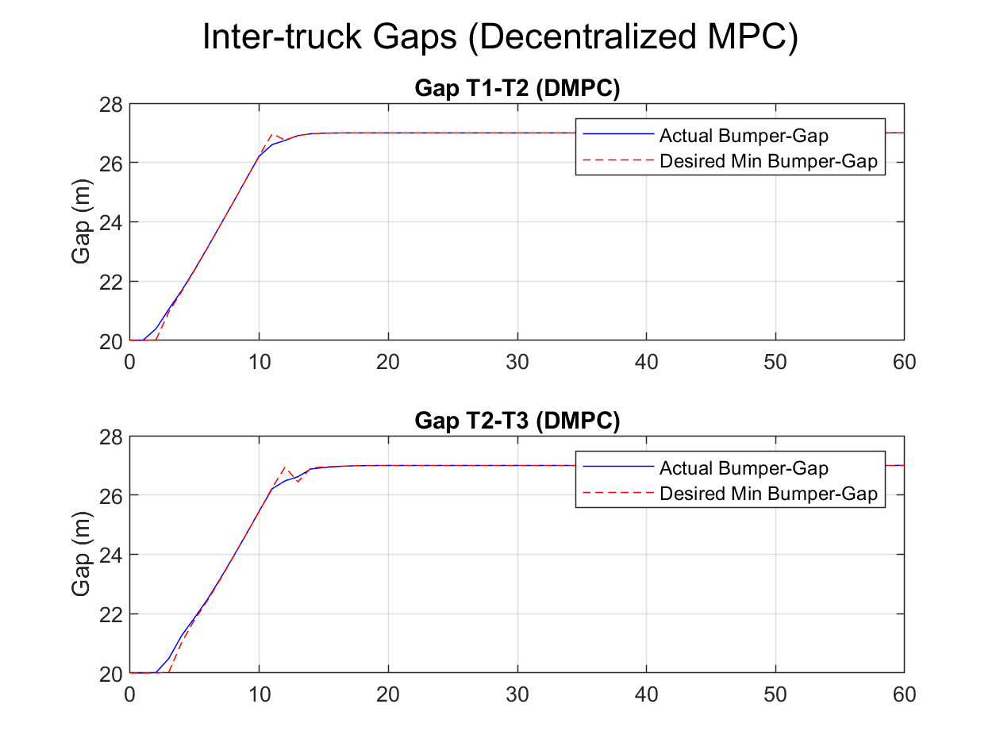

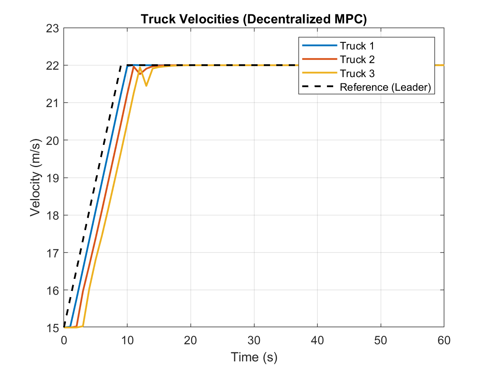

### Limitations and Future Prospects

This script demonstrates the basic framework of DMPC but has several important simplifications and limitations:

1. **Prediction of Preceding Vehicle:** The prediction of the preceding vehicle's future trajectory used by followers is very simple (e.g., assuming constant acceleration). More advanced DMPC would involve receiving the planned trajectory (or part of it) from the preceding vehicle's MPC via communication, or using more sophisticated prediction models (e.g., Kalman filters).
2. **Communication:** Actual communication delays, packet loss, and bandwidth limitations are not considered.
3. **Sequential Solution and Convergence:** The sequential approach where trucks solve their problems in turn within each time step results in a one-way flow of information. To obtain a more cooperative solution, algorithms that involve exchanging information among trucks and iterating local optimizations several times within the same time step (e.g., integrating ADMM or game-theoretic approaches into DMPC) could be considered. This could improve system-wide convergence and performance but would increase computational load.
4. **Stability:** Ensuring the stability of distributed control systems is generally a challenging task. This script does not include explicit guarantees of stability.
5. **Solver:** Each local MPC problem uses `fmincon` (an NLP solver). If the problem can be formulated as a Quadratic Programming (QP) problem (e.g., by approximating the fuel model with a quadratic function and linearizing dynamics), using `quadprog` or dedicated MPC solvers (e.g., `mpcActiveSetSolver`, though this is part of the MATLAB MPC Toolbox) could improve computational efficiency.

Future prospects to address these limitations include introducing more realistic communication models, exploring cooperative iterative solution methods, control design considering robustness and stability, and potentially improving prediction models using machine learning.

---

## References

2. D. P. Bertsekas, A. Nedić, and A. Ozdaglar, *Convex Analysis and Optimization*, Athena Scientific.

3. **Average Consensus Problem** , in *Distributed Multi-Agent Optimization via Dual Decomposition* (Section 2.8) [Diva Portal](https://www.diva-portal.org/smash/get/diva2%3A453798/FULLTEXT01.pdf) .

4. A. Nedić and A. Ozdaglar, “Distributed Subgradient Methods for Multi‐Agent Optimization,” *IEEE Trans. Autom. Control*, 54(1): 48–61, 2009 [SCIRP](https://www.scirp.org/%28S%28czeh2tfqw2orz553k1w0r45%29%29/reference/referencespapers?referenceid=3220708) .

5. A. Nedić and A. Ozdaglar, “Distributed Subgradient Methods for Multi-Agent Optimization” (final manuscript), MIT [Massachusetts Institute of Technology](https://web.mit.edu/Asuman/Desktop/asuman/www/documents/distributed-journal-final.pdf) .

6. S. Boyd et al., “Distributed Optimization and Statistical Learning via the Alternating Direction Method of Multipliers,” *Foundations and Trends in Machine Learning*, 3(1): 1–122, 2011 [Stanford University](https://web.stanford.edu/~boyd/papers/pdf/admm_distr_stats.pdf) .

7. **Consensus ALADIN**  framework for nonconvex consensus optimization, Xu Du et al., 2023 [arXiv](https://arxiv.org/pdf/2306.05662) .

8. G. Buzzard et al., “Optimization-Free Reconstruction Using Consensus Equilibrium,” SIIMS, 2019 [Purdue Engineering](https://engineering.purdue.edu/~bouman/Plug-and-Play/webdocs/SIIMS01.pdf) .

9. Distributed time‐varying optimization with event‐triggered updates in multi‐agent control [ScienceDirect](https://www.sciencedirect.com/science/article/abs/pii/S0893608023006925) .

10. Multi‐layer distributed consensus algorithms for multi‐objective problems [ScienceDirect](https://www.sciencedirect.com/science/article/abs/pii/S0306261921007923) .

11. **Subgradient Method** , Wikipedia, 2024 [en.wikipedia.org](https://en.wikipedia.org/wiki/Subgradient_method) .

*Copyright 2025, The MathWorks, Inc.*
